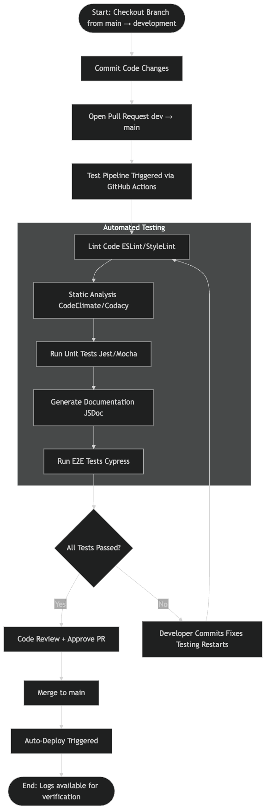

# CI/CD Pipeline – Phase 1 Status (Spring 2025)



## 1. Purpose
Phase 1 hardens our developer workflow: every push or pull‑request triggers an automated build that **lints, tests, analyses, and documents** our code base within ~60 s.  
No deploy/minification yet—that is phase 2.

## 2. Implemented Components  ✅

| Aspect                 | Tool / Action                               | Status |
|------------------------|---------------------------------------------|--------|
| Lint / style check     | **ESLint + Prettier** via npm `run lint`    | working |
| Unit tests             | **Jest** with `npm test -- --ci`            | working |
| Static code quality    | **CodeClimate** GitHub Action               | working |
| Human code review      | **Branch‑protection & PR reviews** on `main`| working |
| Documentation build    | **JSDoc** ‑ generated HTML uploaded as artifact | working |
| Artifact storage       | `actions/upload-artifact@v4`                | working |
| e2e / pixel tests      | Cypress smoke suite – runs after unit tests | working |

> **Conditional execution** – All Node‑specific jobs are wrapped in  
> `if: ${{ hashFiles('**/package.json') != '' }}`.  
> This keeps the pipeline green on days when the repo contains only non‑JS assets.

## 3. Workflow Triggers
| Event            | Jobs executed |
|------------------|---------------|
| `push` to any branch | full pipeline |
| `pull_request` to `main` | full pipeline + required checks |

## 4. How to Re‑run Locally (developers)
```bash
npm ci          # install
npm run lint    # ESLint
npm test        # Jest
npm run docs    # JSDoc → /docs
```

## 5. Notes
See `.github/workflows/main.yml` for full pipeline logic.