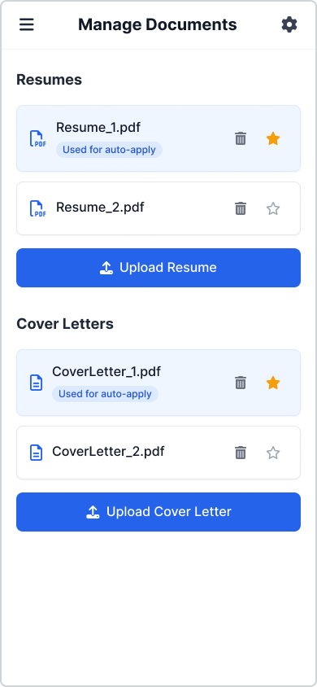
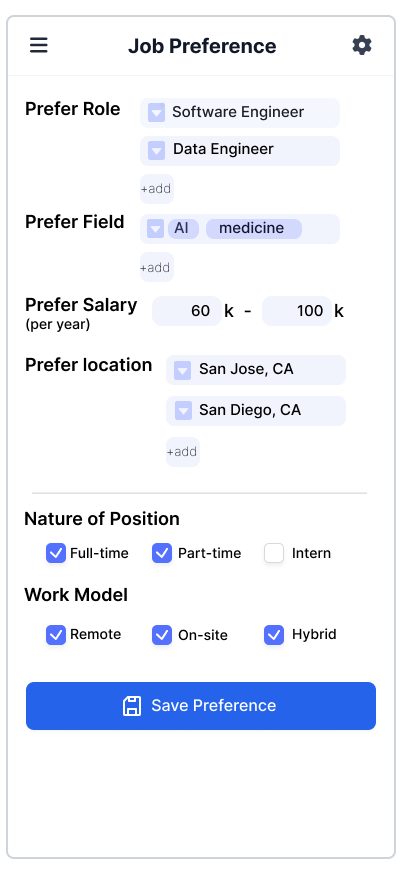
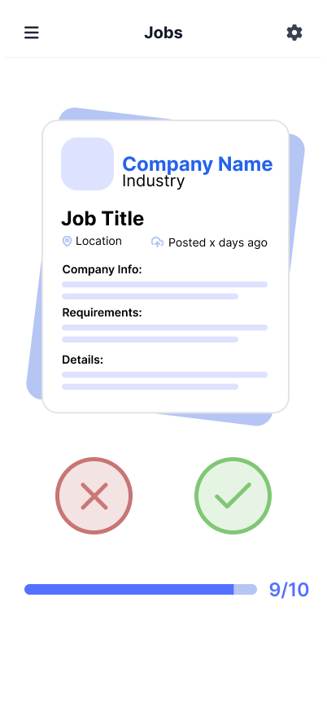
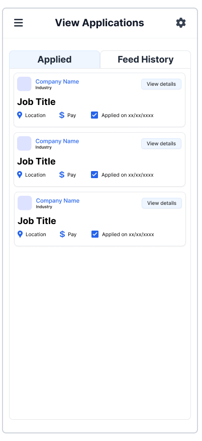

# Sprint Review – 5/18/2025

## Attendees:
- Aaron
- Ansh
- Sanggeon
- Daniel
- Natalie
- Yilin

## Figma Wireframes:
Figma Link: https://www.figma.com/design/518954xLuyYWAGOPKvNbYw/Wireframes?node-id=71-2&t=i4jmVkMScW5u0KSg-1
- Danny: completed **Manage Documents** page

- Yilin: completed **Job Preferences** page

- Yangyang: completed **Job Feed** page

- Natalie: completed **View Applications** page

## Dataset:
Daniel, Aaron, Ansh, and Gon collaborated on a sample dataset for testing.
- Includes job listings used for job descriptions and preference matching
- AI-assisted organization

🔗 [View Dataset (Google Sheets)](https://docs.google.com/spreadsheets/d/148DsX9alRWyxm_KF_6OyZvU2bVFN1SG4fvFxdQOy4yw/edit?usp=sharing)

## File Structure:
Initial file structure for pages and components has been established.

🔗 [GitHub Repository](https://github.com/cse110-sp25-group3/final-project)
